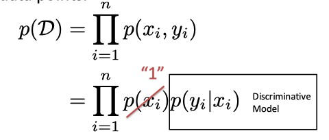
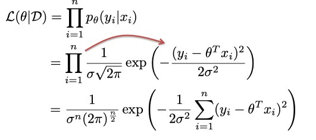
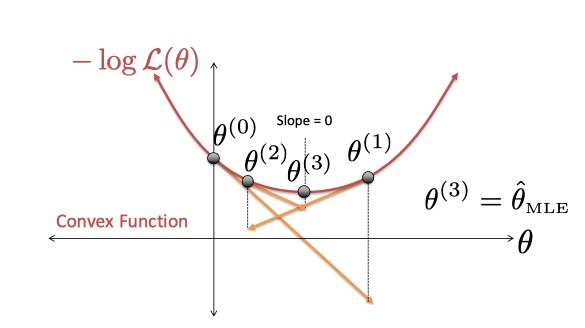
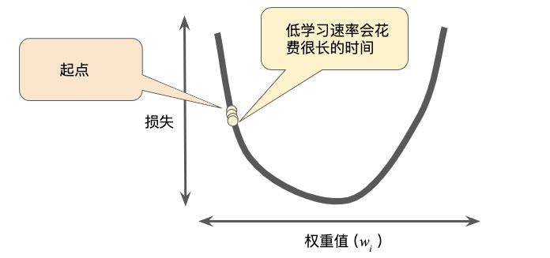
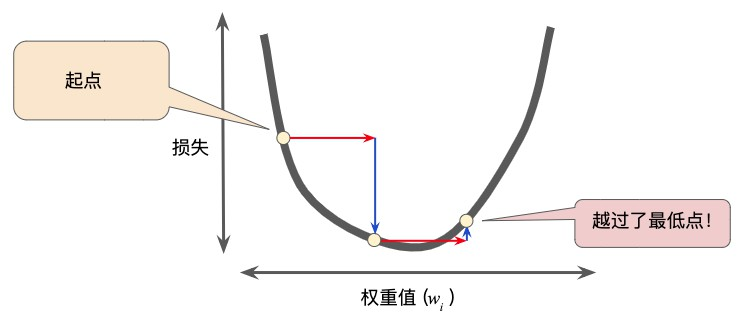
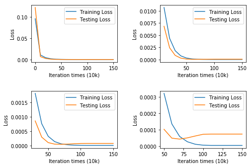
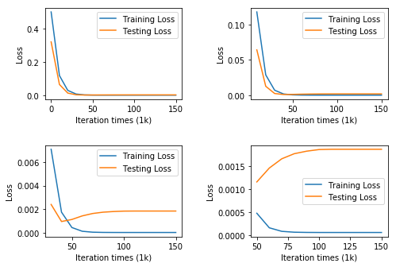
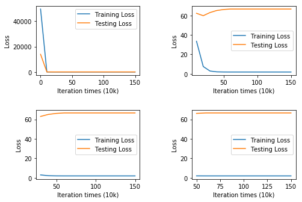
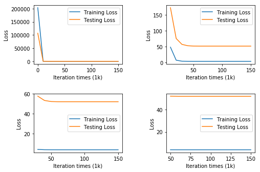
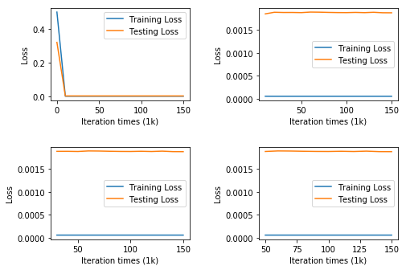

[TOC]

# Homework 2: Multivariate Linear Regression

**16340232 王泽浩** 

github repo：<https://github.com/hansenbeast/2019-SYSU-DM/tree/master/HW2>

## Exercise 1

> 你需要用多少个参数来训练该线性回归模型？请使用梯度下降方法训练。训练时，请把迭代次数设成 1500000，学习率设成 0.00015，参数都设成 0.0。在训练的过程中，每迭代 100000 步，计算训 练样本对应的误差，和使用当前的参数得到的测试样本对应的误差。请画图显示迭代到达 100000 步、 200000 步、… … 1500000 时对应的训练样本的误差和测试样本对应的误差（图可以手画，或者用工具画图）。从画出的图中，你发现什么？请简单分析。
>


### 算法概述

#### 多元线性回归模型

在此多元线性回归模型中，自变量为一个向量，为训练样本的前两列数据，因变量为一个标量，为训练样本的第三列数据


根据如上公式发现需要三个未知参数，其中 $[\beta_1, \beta_2]'$ 为斜率，$\beta_0$ 为偏差项，即截距

由于观测值，即训练数据有若干个，因此把这些观测值按行叠加起来就成为了一个向量或者矩阵表示为


这时多元线性回归的表示就变成了


其中，噪声误差 $\epsilon ～N（0，\sigma^2）$


#### 损失函数

引入最大似然估计 MLE ，**似然函数**与概率非常类似但又有根本的区别，概率为在某种条件（参数）下预测某事件发生的可能性；而似然函数与之相反，为已知该事件的情况下**推测出该事件发生时的条件（参数）**；所以似然估计也称为参数估计，为参数估计中的一种算法

对于单个训练数据，回归模型也可以表示为：


假设数据集是独立同分布的，则联合概率密度函数为



将 p（x，y）带入上式得



因为log函数为单调递增的，不影响极值处理，取对数得


移除不带 $\theta$ 的常数项后


最后得到损失函数为真实值和估计值的误差平方和


**当损失函数最小时，我们就能得到该数据集最吻合的正态分布对应的概率分布函数的总似然最大的情况，也就是我们想要的最优解。**


#### 梯度下降

对凸二次函数使用链式法则进行梯度计算


**梯度决定了损失函数向着局部极小值下降的最快方向，学习率则为步长**



每次迭代，更新 $\theta$


#### 数据归一化

由于以下原因

- 数值计算是通过计算来迭代逼近的，如果自变量量数量级相差太大，则很容易在运算过程中丢失，出现 nan 的结果
- 不同数量级的自变量对权重影响的不同

需要通过预处理，让初始的特征量具有同等的地位，这个预处理的过程为**数据归一化（Normalization）**

归一化一般使用的是**特征缩放（feature scaling）**的方法进行归一化，即


#### 数据标准化

由于在机器学习中，归一化的应用场景是有限，因为当样本中有异常点时，归一化有可能将正常的样本“挤”到一起去。标准化是更常用的手段，可以将训练集中某一列**数值**特征（假设是第i列）的值缩放成均值为0，方差为1的标准正态分布状态。


### 具体代码

使用 python 的 tensorflow 框架进行训练

```python
import tensorflow as tf
import numpy as np
import matplotlib.pyplot as plt
from sklearn import preprocessing   

# Try to find value for W and b to compute y_data = x_data * W + b  

# Define dimensions
d = 2    # Size of the parameter space
N = 50 # Number of data sample

# Model parameters
W = tf.Variable(tf.zeros([d, 1], tf.float32), name="weights")
b = tf.Variable(tf.zeros([1], tf.float32), name="biases")

# Model input and output
x = tf.placeholder(tf.float32, shape=[None, d])
y = tf.placeholder(tf.float32, shape=[None, 1])

# hypothesis
linear_regression_model = tf.add(tf.matmul(x, W), b)
# cost/loss function
loss = tf.reduce_mean(tf.square(linear_regression_model - y)) / 2

# optimizer
optimizer = tf.train.GradientDescentOptimizer(learning_rate=0.00015)
train = optimizer.minimize(loss)

# 导入训练集和测试集
training_filename = "dataForTraining.txt"
testing_filename = "dataForTesting.txt"
training_dataset = np.loadtxt(training_filename)
testing_dataset = np.loadtxt(testing_filename)
dataset = np.vstack((training_dataset,testing_dataset))

# 保存训练集中的参数（均值、方差）直接使用其对象转换测试集数据
# 特征缩放
min_max_scaler = preprocessing.MinMaxScaler() 
# 标准化
normal_scaler = preprocessing.StandardScaler().fit(training_dataset)
# 归一化
dataset = min_max_scaler.fit_transform(dataset)
# 标准化
training_dataset = normal_scaler.transform(training_dataset)
testing_dataset = normal_scaler.transform(testing_dataset)

x_train = np.array(training_dataset[:,:2])
y_train = np.array(training_dataset[:,2:3])
x_test = np.array(testing_dataset[:,:2])
y_test = np.array(testing_dataset[:,2:3])

save_step_loss = {"step":[],"train_loss":[],"test_loss":[]}# 保存step和loss用于可视化操作
init = tf.global_variables_initializer()
with tf.Session() as sess:
    sess.run(init)  # reset values to wrong
    steps = 150001
    for i in range(steps):
        sess.run(train, {x: x_train, y: y_train})
        if i % 10000 == 0:
            # evaluate training loss
            print("iteration times: %s" % i)
            curr_W, curr_b, curr_train_loss = sess.run([W, b, loss], {x: x_train, y: y_train})
            print("W: %s \nb: %s \nTrain Loss: %s" % (curr_W, curr_b, curr_train_loss))
            # evaluate testing loss
            curr_test_loss = sess.run(loss,{x:x_test,y:y_test})
            print("Test Loss: %s\n" % curr_test_loss)
            save_step_loss["step"].append(i)
            save_step_loss["train_loss"].append(curr_train_loss)
            save_step_loss["test_loss"].append(curr_test_loss)

#画图损失函数变化曲线
...
```


### 结果分析

当学习率为 0.00015 ，初始参数都为 0 ，并且**对原始数据进行特征缩放归一化**处理后的结果（每步误差为损失函数的函数值）

| 迭代次数 | 训练误差      | 测试误差     |
| -------- | ------------- | ------------ |
| 10万     | 0.00026552752       | 0.0018572807    |
| 20万     | 0.00026552752 | 0.0018572807 |
| ...     | ... | ... |

通过结果发现误差很快收敛（在10万次以内），可能由于损失函数的选择导致在计算梯度的时候较大，收敛较快。


故将损失函数从


修改为
$$
\frac{1}{2n}\sum^n_{i=1}{(y_i - \theta^Tx_i)^2} ，公式（1.2）
$$


```python
# cost/loss function
loss = tf.reduce_mean(tf.square(linear_regression_model - y)) / 2
```


再次训练的结果为


| 迭代次数 | 训练误差      | 测试误差       |
| -------- | ------------- | -------------- |
| 10万     | 0.010694978   | 0.0068427073   |
| 20万     | 0.004365819   | 0.0024256264   |
| 30万     | 0.0018175665  | 0.0008579258   |
| 40万     | 0.0007625969  | 0.0002942976   |
| 50万     | 0.00032301687 | 0.000104038816 |
| 60万     | 0.00013708518 | 5.0109502e-05  |
| 70万     | 6.0287868e-05 | 4.431181e-05   |
| 80万     | 2.7964898e-05 | 5.1905798e-05  |
| 90万     | 1.2988224e-05 | 6.3162064e-05  |
| 100万    | 7.280114e-06  | 7.358234e-05   |
| 110万    | 5.8223914e-06 | 7.497685e-05  |
| ...      | ...           | ...            |

**见图 1.1**	

发现收敛速度明显变慢，并且最终的测试误差大于训练误差，说明损失函数通过影响梯度的计算从而影响迭代的速度


保持损失函数为 1.2 式不变，**对原始数据进行标准化**，发现收敛速度变快，说明**对于线性model来说**，数据标准化后，最优解的寻优过程明显会变得平缓，更容易快速地收敛到最优解。

**见图 1.2**

​		

**保持损失函数为 MSE/2 （公式2.1）不变**，忽略归一化的步骤，**直接利用原始数据进行训练的结果**为

| 迭代次数 | 训练误差  | 测试误差  |
| -------- | --------- | --------- |
| 10万     | 33.503178 | 62.241535 |
| 20万     | 7.535531  | 59.77898  |
| 30万     | 2.9105134 | 63.006298 |
| 40万     | 2.089079  | 65.11604  |
| 50万     | 1.9431273 | 66.11772  |
| 60万     | 1.9135444 | 66.6166|
| ...      | ...       | ...       |

**见图1.3**

发现测试误差一直稳定在一个范围，训练误差会收敛到一个较小值


## Exercise 2

> 现在，你改变学习率，比如把学习率改成 0.0002（此时，你可以保持相同的迭代次数也可以改变迭代次数），然后训练该回归模型。你有什么发现？请简单分析。
>

### 结果分析

改变学习率，其余不变，损失函数为
$$
\frac{1}{2n}\sum^n_{i=1}{(y_i - \theta^Tx_i)^2}
$$


```python
optimizer = tf.train.GradientDescentOptimizer(learning_rate=0.0002)
```

**未进行归一化标准化**时，不同于第一问，由于学习率的增加，导致迭代到10万次时就产生 nan 的结果，说明对于**没有预处理的数据，此学习率过大，导致梯度爆炸**


进行**特征缩放归一化后**的结果

| 迭代次数 | 训练误差      | 测试误差      |
| -------- | :------------ | ------------- |
| 10万     | 0.007903346   | 0.004828136   |
| 20万     | 0.0024309573  | 0.0012166699  |
| 30万     | 0.0007622265  | 0.00029435699 |
| 40万     | 0.00024147338 | 7.637401e-05  |
| 50万     | 7.796503e-05  | 4.368423e-05  |
| 60万     | 2.6596446e-05 | 5.2485626e-05 |
| 70万     | 1.1197945e-05 | 6.337282e-05  |
| 80万     | 5.463813e-06  | 7.764882e-05  |
| 90万     | 4.4367066e-06 | 7.910379e-05  |
| ...      | ...           | ... |

**见图 2.1**

相比较于第一问（**图1.1**）在110万迭代次数误差收敛，对于相同数量级的训练和测试误差，在迭代次数到达80万时就会收敛

说明**在一定范围内学习率越大，收敛速度越快**，但过大也会导致错过极小值点，造成误差的波动


进行**标准化后**的结果

**见图2.2**

相比较于第一问（**图1.2**）同样会在 10 万次以内收敛，但收敛速度较之前快，印证了如上结论。


## Exercise 3

现在，我们使用其他方法来获得最优的参数。你是否可以用随机梯度下降法获得最优的参数？ 请使用随机梯度下降法画出迭代次数（每 K 次，这里的 K 你自己设定）与训练样本和测试样本对应的误差的图。比较 Exercise 1 中的实验图，请总结你的发现。


### 结果分析

随机梯度下降减少了每次计算梯度的复杂度，每次迭代随机选择一个训练样本的误差进行梯度计算


```python
random_index = np.random.choice(N)
sess.run(train, {x: [x_train[random_index]], y:[y_train[random_index]]})
```

同样每10万次显示训练误差和测试误差，忽略归一化的步骤，**直接利用原始数据进行训练的结果**为
| 迭代次数 | 训练误差    | 测试误差      |
| -------- | :---------- | ------------- |
| 10万     | 161.6851    | 144.4163     |
| 20万     | 127.918045  | 98.57767     |
| 30万     | 108.15653   | 91.89929     |
| 40万     | 92.329544   | 94.36559     |
| 50万     | 78.49047    | 66.74569     |
| 60万     | 66.81178    | 61.61593     |
| 70万     | 60.5053     | 98.280365    |
| 80万     | 46.82453    | 63.856804    |
| 90万     | 43.613724   | 44.74122     |
| 100万    | 36.005184   | 82.44847     |
| 110万    | 30.851025   | 44.956745    |
| 120万    | 25.451572   | 73.33224     |
| 130万    | 24.91912    | 87.98949     |
| 140万    | 17.78771    | 60.099987    |
| 150万    | 15.59241    | 67.05955     |

**见图3.1**


进行**特征缩放归一化**后的结果
| 迭代次数 | 训练误差    | 测试误差      |
| -------- | :---------- | ------------- |
| 10万     | 0.026291719 | 0.02453852 |
| 20万     | 0.02281258 | 0.016967352 |
| 30万     | 0.020685606 | 0.014727803 |
| 40万     | 0.018772917 | 0.013070367 |
| 50万     | 0.017057486 | 0.011766525 |
| 60万     | 0.015512738 | 0.01053579 |
| 70万     | 0.014111637 | 0.009377027 |
| 80万     | 0.012857355 | 0.008413457 |
| 90万     | 0.011722922 | 0.0076271156 |
| 100万    | 0.010690902 | 0.006848436 |
| 110万    | 0.009750936 | 0.0061822557 |
| 120万    | 0.008906187 | 0.00556877 |
| 130万    | 0.008138204 | 0.005002712 |
| 140万    | 0.0074382448 | 0.004475654 |
| 150万    | 0.0067942357 | 0.004023999 |

**见图 3.2**


进行**标准化后**的结果

**见图3.3**


## 总结

### 标准化和归一化

1. 归一化是将训练集中某一列**数值**特征（假设是第i列）的值缩放到0和1之间
2. 标准化是将训练集中某一列**数值**特征（假设是第i列）的值缩放成均值为0，方差为1的状态
3. 归一化和标准化的相同点都是对**某个特征（column）**进行缩放（scaling）而不是对某个样本的特征向量（row）进行缩放
4. 归一化是让不同维度之间的特征在数值上有一定比较性，可以大大提高模型精度。
5. **对于线性model来说**，数据归一化后，最优解的寻优过程明显会变得平缓，更容易正确的收敛到最优解。


前者是没有经过归一化的，在梯度下降的过程中，走的路径更加的曲折，而第二个图明显路径更加平缓，收	敛速度更快。标准化前，由于变量的单位相差很大，导致了椭圆型的梯度轮廓。标准化后，把变量变成统一单位，产生了圆形轮廓。由于梯度下降是按切线方向下降，所以导致了系统在椭圆轮廓不停迂回地寻找最优解，而圆形轮廓就能轻松找到了。一种比较极端的情况，有时没做标准化，模型始终找不到最优解，一直不收敛。


### 学习率

**学习率为超参数**，如果选择的学习速率过小，收敛速度慢，会花费太长的训练时间：



如果学习率过大，会在极小值点附近波动，无法收敛



训练应当从相对较大的学习率开始。这是因为在开始时，初始的随机权重远离最优值。在训练过程中，学习率应当下降，以允许细粒度的权重更新。


### SGD

由于在每次参数更新前对相似的样例进行梯度重复计算， 批量梯度下降会在大数据集上进行冗余计算。SGD通过每次计算一个样例的方式避开这种冗余。因此，SGD速度会更快并支持在线学习。

随机剃度下降是不会收敛的，它总是在最优点附近跳来跳去。即使我们到达了最优点，它依然会跳动，因为对于随机的样本来说，这些少数的样本在最优点的梯度也未必是0（整体的梯度是0）。

有一个方法可以使随机梯度下降收敛——让步长衰减。因为随机梯度很快就能到达最优点附近，如果步长逐步减小，最终它会停在最优点附近一个较优的点上（未必是正好停在最优点）。

**但是，SGD伴随的一个问题是噪音较BGD要多，使得SGD并不是每次迭代都向着整体最优化方向。**


## 图例

1.1



1.2



1.3



2.1


2.2


3.1


3.2



3.3



