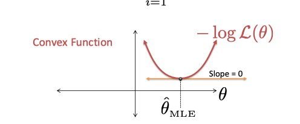

[TOC]

# Homework 2: Multivariate Linear Regression

**16340232 王泽浩** 

github repo：<https://github.com/hansenbeast/2019-SYSU-DM/tree/master/HW2>

## Exercise 1

你需要用多少个参数来训练该线性回归模型？请使用梯度下降方法训练。训练时，请把迭代次数设成 1500000，学习率设成 0.00015，参数都设成 0.0。在训练的过程中，每迭代 100000 步，计算训 练样本对应的误差，和使用当前的参数得到的测试样本对应的误差。请画图显示迭代到达 100000 步、 200000 步、… … 1500000 时对应的训练样本的误差和测试样本对应的误差（图可以手画，或者用工具画 图）。从画出的图中，你发现什么？请简单分析。


### 算法概述

#### 多元线性回归模型

在此多元线性回归模型中，自变量为一个向量，为训练样本的前两列数据，因变量为一个标量，为训练样本的第三列数据


根据如上公式发现需要三个未知参数，其中 $[\beta_1, \beta_2]'$ 为斜率，$\beta_0$ 为偏差项，即截距

由于观测值，即训练数据有若干个，因此把这些观测值按行叠加起来就成为了一个向量或者矩阵表示为


这时多元线性回归的表示就变成了


其中，噪声误差 $\epsilon ～N（0，\sigma^2）$


#### 损失函数

引入最大似然估计 MLE ，**似然函数**与概率非常类似但又有根本的区别，概率为在某种条件（参数）下预测某事件发生的可能性；而似然函数与之相反，为已知该事件的情况下**推测出该事件发生时的条件（参数）**；所以似然估计也称为参数估计，为参数估计中的一种算法

对于单个训练数据，回归模型也可以表示为：


假设数据集是独立同分布的，则联合概率密度函数为


将 p（x，y）带入上式得


因为log函数为单调递增的，不影响极值处理，取对数得


移除不带 $\theta$ 的常数项后


最后得到损失函数为真实值和估计值的误差平方和


**当损失函数最小时，我们就能得到该数据集最吻合的正态分布对应的概率分布函数的总似然最大的情况，也就是我们想要的最优解。**


#### 梯度下降

对凸二次函数使用链式法则进行梯度计算




**梯度决定了损失函数向着局部极小值下降的最快方向，学习率则为步长**


每次迭代，更新 $\theta​$


#### 数据标准化

由于以下原因

- 数值计算是通过计算来迭代逼近的，如果自变量量数量级相差太大，则很容易在运算过程中丢失，出现 nan 的结果
- 不同数量级的自变量对权重影响的不同

需要通过预处理，让初始的特征量具有同等的地位，这个预处理的过程为**数据标准化（Normalization）**

本次使用的是**特征缩放（feature scaling）**的方法进行标准化，即


### 具体代码

使用 python 的 tensorflow 框架进行训练

```python
import tensorflow as tf
import numpy as np
import matplotlib.pyplot as plt
from sklearn import preprocessing   

# Try to find value for W and b to compute y_data = x_data * W + b  

# Define dimensions
d = 2    # Size of the parameter space
N = 50 # Number of data sample

# Model parameters
W = tf.Variable(tf.zeros([d, 1], tf.float32), name="weights")
b = tf.Variable(tf.zeros([1], tf.float32), name="biases")

# Model input and output
x = tf.placeholder(tf.float32, shape=[None, d])
y = tf.placeholder(tf.float32, shape=[None, 1])

# hypothesis
linear_regression_model = tf.add(tf.matmul(x, W), b)
# cost/loss function
loss = tf.reduce_sum(tf.square(linear_regression_model - y))

# optimizer
optimizer = tf.train.GradientDescentOptimizer(learning_rate=0.00015)
train = optimizer.minimize(loss)

training_filename = "dataForTraining.txt"
testing_filename = "dataForTesting.txt"
training_dataset = np.loadtxt(training_filename)
testing_dataset = np.loadtxt(testing_filename)
dataset = np.vstack((training_dataset,testing_dataset))
min_max_scaler = preprocessing.MinMaxScaler()  
dataset = min_max_scaler.fit_transform(dataset)

x_train = np.array(dataset[:50,:2])
y_train = np.array(dataset[:50,2:3])
x_test = np.array(dataset[50:,:2])
y_test = np.array(dataset[50:,2:3])

save_step_loss = {"step":[],"train_loss":[],"test_loss":[]}# 保存step和loss用于可视化操作
init = tf.global_variables_initializer()
with tf.Session() as sess:
    sess.run(init)  # reset values to wrong
    steps = 1500001
    for i in range(steps):
        sess.run(train, {x: x_train, y: y_train})
        if i % 100000 == 0:
            # evaluate training loss
            print("iteration times: %s" % i)
            curr_W, curr_b, curr_train_loss = sess.run([W, b, loss], {x: x_train, y: y_train})
            print("W: %s \nb: %s \nTrain Loss: %s" % (curr_W, curr_b, curr_train_loss))
            # evaluate testing loss
            curr_test_loss = sess.run(loss,{x:x_test,y:y_test})
            print("Test Loss: %s\n" % curr_test_loss)
            save_step_loss["step"].append(i)
            save_step_loss["train_loss"].append(curr_train_loss)
            save_step_loss["test_loss"].append(curr_test_loss)

#画图损失函数变化曲线
...
```


### 结果分析

当学习率为 0.00015 ，初始参数都为 0 ，并且对原始数据进行特征缩放标准化处理后的结果（每步误差为损失函数的函数值）

| 迭代次数 | 训练误差      | 测试误差     |
| -------- | ------------- | ------------ |
| 10万     | 9.29617       | 2.3778727    |
| 20万     | 0.00026552752 | 0.0018572807 |
| 30万     | 0.00026552752 | 0.0018572807 |
| ...      | ...           | ...          |

通过结果发现误差很快收敛，可能由于损失函数的选择导致在计算梯度的时候较大，收敛较快。


将损失函数从


修改为
$$
\frac{1}{2n}\sum^n_{i=1}{(y_i - \theta^Tx_i)^2}
$$

```python
# cost/loss function
loss = tf.reduce_mean(tf.square(linear_regression_model - y)) / 2
```


再次训练的结果为


| 迭代次数 | 训练误差      | 测试误差       |
| -------- | ------------- | -------------- |
| 10万     | 0.09566953    | 0.122102775    |
| 20万     | 0.010694978   | 0.0068427073   |
| 30万     | 0.004365819   | 0.0024256264   |
| 40万     | 0.0018175665  | 0.0008579258   |
| 50万     | 0.0007625969  | 0.0002942976   |
| 60万     | 0.00032301687 | 0.000104038816 |
| 70万     | 0.00013708518 | 5.0109502e-05  |
| 80万     | 6.0287868e-05 | 4.431181e-05   |
| 90万     | 2.7964898e-05 | 5.1905798e-05  |
| 100万    | 1.2988224e-05 | 6.3162064e-05  |
| 110万    | 7.280114e-06  | 7.358234e-05   |
| 120万    | 5.8223914e-06 | 7.497685e-05   |
| ...      | ...           | ...            |

发现收敛速度明显变慢，并且最终的测试误差大于训练误差


保持损失函数不变，忽略标准化的步骤，**直接利用原始数据进行训练的结果**为

| 迭代次数 | 训练误差  | 测试误差  |
| -------- | --------- | --------- |
| 10万     | 49610.42  | 13945.736 |
| 20万     | 33.503178 | 62.241535 |
| 30万     | 7.535531  | 59.77898  |
| 40万     | 2.9105134 | 63.006298 |
| 50万     | 2.089079  | 65.11604  |
| 60万     | 1.9431273 | 66.11772  |
| 70万     | 1.9135444 | 66.6166   |
| ...      | ...       | ...       |


见图1.2.1～1.2.3


​												1.2.1


​												1.2.2


​												1.2.3


## Exercise 2

现在，你改变学习率，比如把学习率改成 0.0002（此时，你可以保持相同的迭代次数也可以改变迭代次数），然后训练该回归模型。你有什么发现？请简单分析。

### 结果分析

改变学习率，其余不变，损失函数为
$$
\frac{1}{2n}\sum^n_{i=1}{(y_i - \theta^Tx_i)^2}
$$


```python
optimizer = tf.train.GradientDescentOptimizer(learning_rate=0.0002)
```

未进行标准化时，不同于第一问，由于学习率的增加，导致迭代到10万次时产生nan的结果


进行特征缩放后的结果

| 迭代次数 | 训练误差      | 测试误差      |
| -------- | :------------ | ------------- |
| 10万     | 0.095660314   | 0.122091904   |
| 20万     | 0.007903346   | 0.004828136   |
| 30万     | 0.0024309573  | 0.0012166699  |
| 40万     | 0.0007622265  | 0.00029435699 |
| 50万     | 0.00024147338 | 7.637401e-05  |
| 60万     | 7.796503e-05  | 4.368423e-05  |
| 70万     | 2.6596446e-05 | 5.2485626e-05 |
| 80万     | 1.1197945e-05 | 6.337282e-05  |
| 90万     | 5.463813e-06  | 7.764882e-05  |
| 100万    | 4.4367066e-06 | 7.910379e-05  |
| ...      | ...           | ...           |

相比较于第一问的120万迭代次数，对于相同数量级的训练和测试误差，在迭代次数到达90万时就会收敛

说明在一定范围内学习率越大，收敛速度越快，但过大也会导致错过极小值点，造成误差的波动


## Exercise 3

现在，我们使用其他方法来获得最优的参数。你是否可以用随机梯度下降法获得最优的参数？ 请使用随机梯度下降法画出迭代次数（每 K 次，这里的 K 你自己设定）与训练样本和测试样本对应的误 差的图。比较 Exercise 1 中的实验图，请总结你的发现。


### 结果分析

```python
random_index = np.random.choice(N)
sess.run(train, {x: [x_train[random_index]], y:[y_train[random_index]]})
```

